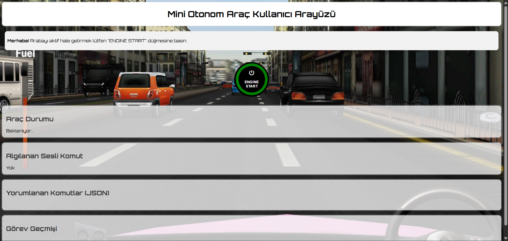
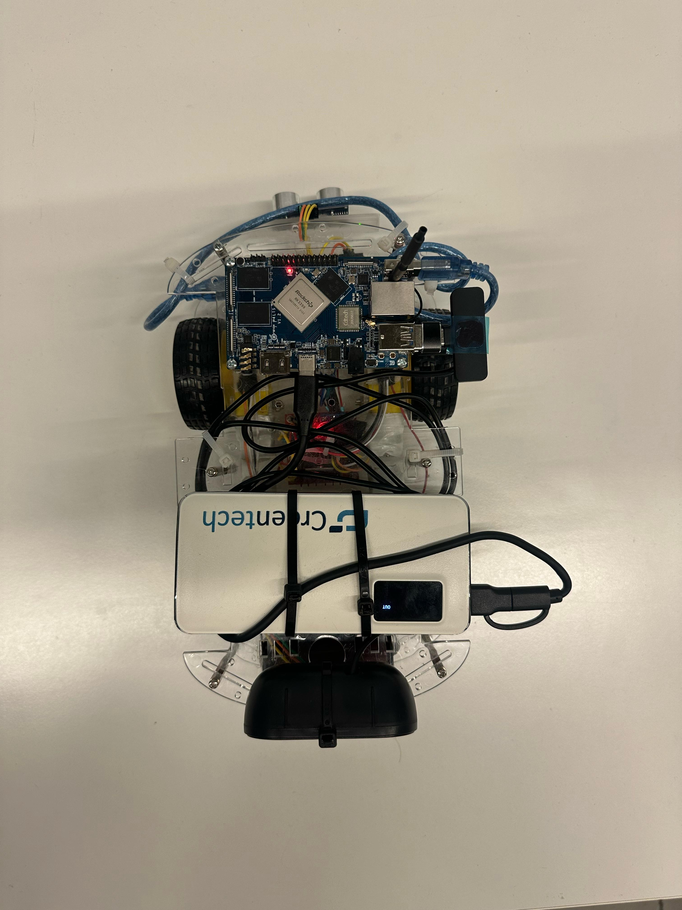
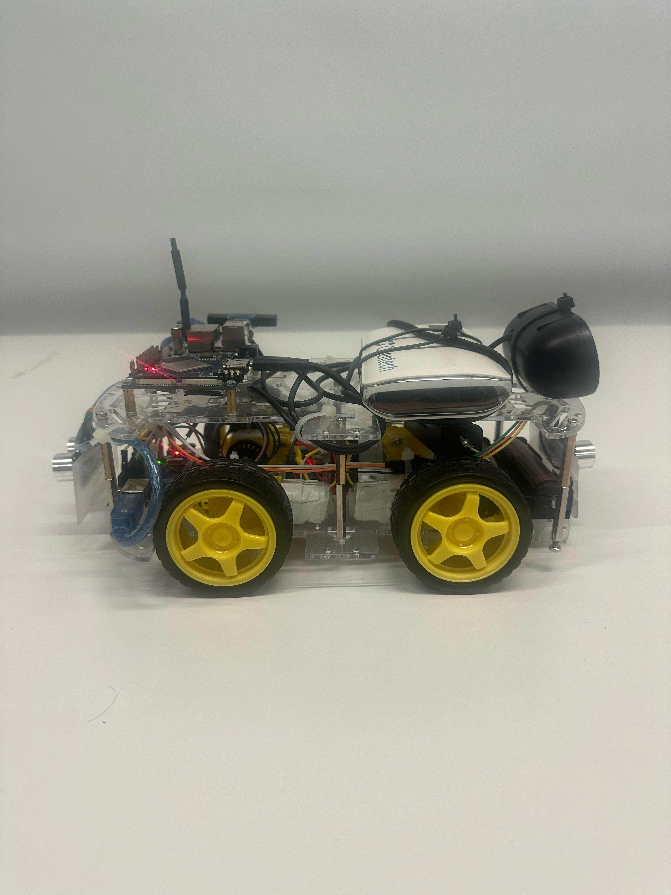

# TOBB ETÜ ELE495 - Capstone Project

# Table of Contents
- [Introduction](#introduction)
- [Features](#features)
- [Installation](#installation)
- [Usage](#usage)
- [Screenshots](#screenshots)
- [Acknowledgements](#acknowledgements)

## Introduction
This project, titled *"DOĞAL DİL İLE KONTROL EDİLEBİLEN OTONOM MİNİ ARAÇ"* (Voice-Controlled Autonomous Mini Vehicle), was developed as part of the 2024–2025 Summer ELE 495 Capstone Design Project(ELE495 Bitirme Tasarım Projesi) course.

The main objective of this project is to design a wheeled autonomous mini vehicle that can understand spoken natural Turkish commands and convert them into low-level movement instructions that it can execute. The vehicle uses a microphone and a speech-to-text (STT) system to capture voice commands from the user and sends the transcribed text to a large language model (LLM) for interpretation. The LLM parses the natural language and converts it into a sequence of basic movement commands (e.g., move forward, turn left, etc.).

These commands are then executed on the vehicle using onboard sensors and motor control logic. While performing these actions, the system provides natural-sounding Turkish spoken feedback to the user using the **Text-to-Speech (TTS) API**, enabling lifelike, expressive responses. The goal is to create a more human-like interaction by minimizing robotic speech patterns.

A typical usage scenario might include a user saying:  
*"Engel çıkana kadar düz git, sonra sola dön, 2 saniye ileri git, sağa dön."*  
The system records the command, processes it using STT and LLM modules, and executes the parsed instructions in order using motor drivers and sensor input. During execution, the system responds with real-time Turkish voice feedback such as *"İleri gidiyorum."* or *"Sola dönüyorum."*

## Features
### Hardware
  - OrangePi 4 LTS: [https://www.robotistan.com/orange-pi-4-lts-4gb](https://www.robotistan.com/orange-pi-4-lts-4gb)
  -  Arduino UNO R3: [https://www.robotistan.com/arduino-uno-r3-klon-usb-kablo-hediyeli-usb-chip-ch340?language=tr&h=424a5daa](https://www.robotistan.com/arduino-uno-r3-klon-usb-kablo-hediyeli-usb-chip-ch340?language=tr&h=424a5daa)
  -  4WD Robot Araba Platformu: [https://www.direnc.net/4wd-robot-araba-platform-4wd-smart-car](https://www.direnc.net/4wd-robot-araba-platform-4wd-smart-car)
  -  L298N Voltaj Regülatörlü Çift Motor Sürücü Kartı: [https://www.robotistan.com/l298n-voltaj-regulatorlu-cift-motor-surucu-karti](https://www.robotistan.com/l298n-voltaj-regulatorlu-cift-motor-surucu-karti)
  -  DAYTONA K9 Type-C Wireless Yaka Mikrofonu: [https://www.mediamarkt.com.tr/tr/product/_daytona-k9-type-c-wireless-yaka-mikrofonu-1224996.html](https://www.mediamarkt.com.tr/tr/product/_daytona-k9-type-c-wireless-yaka-mikrofonu-1224996.html)
  -  Mini Harici USB Stereo Hoparlör: [https://www.robotistan.com/raspberry-pi-icin-mini-harici-usb-stereo-hoparlor](https://www.robotistan.com/raspberry-pi-icin-mini-harici-usb-stereo-hoparlor)
  -  MPU6050 6 Eksenli Gyro ve Eğim Sensörü: [https://www.direnc.net/mpu6050-3-axis-gyro-ve-egim-sensoru](https://www.direnc.net/mpu6050-3-axis-gyro-ve-egim-sensoru)
  -  HC-SR04 Ultrasonik Mesafe Sensörü: [https://www.robocombo.com/Ultrasonik-Mesafe-Sensoru-HC-SR04,PR-1041.html](https://www.robocombo.com/Ultrasonik-Mesafe-Sensoru-HC-SR04,PR-1041.html)
  -  LG 18650 HG2 3000mAh Li-Ion Pil: [https://www.cimri.com/normal-sarj-edilebilir-piller/en-ucuz-lg-18650-hg2-3000mah-3-7v-20a-li-ion-sarj-edilebilir-pil-fiyatlari%2C1232320338?utm_source=chatgpt.com](https://www.cimri.com/normal-sarj-edilebilir-piller/en-ucuz-lg-18650-hg2-3000mah-3-7v-20a-li-ion-sarj-edilebilir-pil-fiyatlari%2C1232320338?utm_source=chatgpt.com)
  -  Ttec 2BB214UG 10.000mAh Powerbank: [https://www.teknosa.com/ttec-2bb214ug-recharger-pro-lcd-10000-mah-pd-30w-tasinabilir-hizli-sarj-aletipowerbank-uzay-grisi-p-125432432](https://www.teknosa.com/ttec-2bb214ug-recharger-pro-lcd-10000-mah-pd-30w-tasinabilir-hizli-sarj-aletipowerbank-uzay-grisi-p-125432432)
  -  Genel Markalar 18650 Tekli Lityum Ion Pil Yuvası: [https://www.trendyol.com/genel-markalar/18650-pil-yatagi-tekli-lityum-ion-pil-yuvasi-1-kanal-p-135522244?boutiqueId=61&merchantId=730358](https://www.trendyol.com/genel-markalar/18650-pil-yatagi-tekli-lityum-ion-pil-yuvasi-1-kanal-p-135522244?boutiqueId=61&merchantId=730358)
    
### Operating Systems and Packages
**Operating Systems:**
- **Orange Pi 4 LTS** runs a Linux-based Ubuntu operating system.
- **Arduino UNO** uses the Arduino platform with no full operating system (bare-metal programming in C/C++).
- **Development PC** uses Windows 11 for running the web server and interface.

**Packages:**

*Orange Pi Packages:*
- openai
- sounddevice
- scipy
- webrtcvad
- pyserial
- numpy
- flask
- python-socketio
- requests
  

*Interface Packages:*
- socketio
- time
- json

*Arduino Packages:*
- Wire.h
- MPU6050_light.h
- ArduinoJson.h
- math.h

### Applications
- **Voice-Controlled Home Assistant Robots:** The system can serve as a foundation for smart robots that assist users in domestic environments through spoken language.
- **Assistive Mobility Solutions for Individuals With Disabilities:** By eliminating the need for manual control, the system allows users with limited mobility to interact with and command robotic platforms using only voice.
- **Educational and Research Platforms:** The integration of natural language processing, real-time control, and embedded systems makes this project suitable for use in academic settings for teaching and research purposes.
- **Autonomous Patrol or Delivery Robots:** The vehicle can be adapted for simple security patrols or indoor delivery tasks, guided by voice commands rather than manual programming.
- **Public Interactive Robots:** It can be employed in public venues such as museums or fairs as an interactive guide robot, responding to visitor instructions in Turkish.


### Services
- **Speech-to-Text (STT) Service:** Spoken Turkish commands are transcribed into text using OpenAI’s Whisper-1 model via an online API. This service captures user input and converts it into textual data for processing.
- **Natural Language Interpretation Service (LLM):** The transcribed text is sent to GPT-4o mini, which interprets the natural language command and converts it into a sequence of low-level movement instructions. This interaction is performed through an online API.
- **Text-to-Speech (TTS) Service:** After executing each command, the system provides verbal feedback in Turkish using Alloy TTS, producing clear and human-like voice responses to enhance user interaction.


### Installation
####  Prerequisites:
To run the project smoothly, the following software and libraries need to be installed:

##### **Python and Required Packages on Orange Pi**
- **Python 3.10 or higher** should be installed on the Orange Pi.
You can check your Python version with:
```bash
python3 --version
```
- The following Python packages must be installed:
```bash
pip install openai sounddevice scipy webrtcvad pyserial numpy flask python-socketio requests
```
Note: time and json are part of the Python standard library and do not need to be installed separately.

##### **Required Arduino Libraries**
- First, install the **Arduino IDE** on your computer:
Download it from the official site: [https://www.arduino.cc/en/software](https://www.arduino.cc/en/software)
- Then, open the Arduino IDE and install the necessary libraries: **Wire.h (usually pre-installed), MPU6050_light.h, ArduinoJson.h, math.h (standard Arduino library).**

##### **On the Computer (PC)** 
To work with the project’s web interface and manage the Orange Pi and Arduino devices, make sure the following tools are installed on your computer:
- **Node.js:** The web interface requires Node.js. [https://nodejs.org/]( https://nodejs.org/)
- **PuTTY:** For connecting via SSH to Orange Pi or other devices, install PuTTY. [https://www.putty.org/](https://www.putty.org/)
- **FileZilla:** For easy file transfer between your computer and Orange Pi, install FileZilla. [https://filezilla-project.org/](https://filezilla-project.org/)
- All devices must be connected to the **same local network.**

##### **Voice Recording**
- For voice authentication, your voice recordings must be in **.wav format**. Ensure your recordings are clear and noise-free for accurate recognition.

##### **OpenAI API Key**
- You must create an OpenAI API key to enable AI features in the project. Sign up or log in at [https://platform.openai.com/account/api-keys](https://platform.openai.com/account/api-keys). Create a new API key and save it securely. You will need to add this key to the appropriate configuration file or environment variable in the project before running it. 

#### Installation Steps:
1) Open your terminal or command prompt and run:
```bash
git clone https://github.com/YOUR_USERNAME/YOUR_REPOSITORY.git
```

2) Open FileZilla and connect to your Orange Pi by entering **host(Orange Pi’s IP address), username(your Orange Pi username), password(your Orange Pi password) and port (generally 22 for SFTP/SSH).** Transfer the cloned Orange Pi project files and your voice record from your computer to the appropriate directory on the Orange Pi.
   
3) Open the Arduino IDE on your computer. Connect your Arduino board to your computer via USB. Open the Arduino sketch from the cloned repository. Select the correct board and port in Arduino IDE. Upload the code to the Arduino board.
   
4) Find your computer's local IP address. On Windows, you can run (e.g., 192.168.1.10):
```bash
ipconfig
```
Inside **client_sender.py**, find this line and replace it with your actual IP address:
```bash
SERVER_URL = "http://your_ip:3000"
```
After saving, re-send the **updated client_sender.py** file to your Orange Pi via FileZilla, replacing the old one.

5) Navigate to the **interface** folder inside the cloned repository on your PC. Double-click the arayuz_ac.vbs file to start the server.-Open PuTTY and enter the Orange Pi’s IP address to connect via SSH. Login with your Orange Pi credentials.

6) Connect to Orange Pi via SSH using PuTTY and open terminal. Activate the Python virtual environment if not already active:
```bash
source venv/bin/activate
```
Run **voiceprint_builder.py** to record your voice for authentication, you need to run this script only once to record and save your voice signatures before running the main control program:
```bash
python3 voiceprint_builder.py
```
When the process completes successfully, the output will be:
```bash
Voiceprints of group members have been saved.
```

7) Open **robot_main.py** file on your PC and locate the USER CONFIG section, which looks like this:
```bash
# === USER CONFIG ==========================================================
CONFIG = {
    # Your OpenAI API key for accessing GPT, Whisper, and TTS services
    "OPENAI_API_KEY": # "sk-...",
    "OPENAI_MODEL":    "gpt-4o-mini",
    "WHISPER_MODEL":   "whisper-1",
    "TTS_MODEL":       "tts-1",
    "TTS_VOICE":       "alloy",
    "CAPTURE_RATE":    48000,
    "PROCESS_RATE":    16000,
    "CHUNK_SEC":       7,
    "AUDIO_DEVICE":    1,
    "USB_SPEAKER_DEVICE": "plughw:2,0",
    "SERIAL_PORT":     "/dev/ttyUSB0",
    "BAUDRATE":        115200,
    "ACK_TIMEOUT":     20.0,
    "VAD_MODE":        2,
    "VAD_SILENCE_MS":  800
}
```
Replace the line "OPEN_API_KEY"" with your actual API key and re-send the **updated robot_main.py** file to your Orange Pi after saving it.

8) You are now ready to start the main control program. Using Orange Pi terminal, run **robot_main.py**:
```bash
python3 robot_main.py
```

### Usage
To ensure proper operation of the system, the hardware components must be correctly connected and powered before use. The initial setup consists of the following steps:
- **System Initialization: Hardware Setup**
  
 1-Powering the Motor Driver: The motor driver board, which controls the movement of the vehicle, is powered by inserting appropriate batteries.

 2-Connecting the Microphone and Speaker: To enable voice input and Turkish voice feedback, a microphone and speaker are connected to the Orange Pi. The microphone is typically connected via USB, while the speaker is connected to the 3.5 mm audio jack or through a USB audio adapter.

 3-Powering the Orange Pi and Arduino: Both the Orange Pi 4 LTS and Arduino UNO are powered using a single external portable power source (e.g., a powerbank). The powerbank is connected to the Orange Pi through its Type-C power input, which powers the board. Once the Orange Pi is turned on, it supplies 5V to the Arduino UNO via its USB port.

 4-The Orange Pi is connected to a Wi-Fi network using a monitor and peripheral input devices during the initial setup phase.

 When the hardware connections are properly completed and the system is successfully powered on, the vehicle informs the user that it is ready to operate by playing the following voice message: “System is ready. Please activate the vehicle.” This feedback indicates that initial system checks have been completed and the user can proceed to start the system via the web interface.

 To ensure proper operation of the interface, the system must be fully powered and connected to the local network before use. The web interface setup consists of the following steps:

- **System Initialization: Interface Usage**

 1-To begin, Node.js must be installed on the system. Then, by double-clicking the arayuz_ac.vbs file, the arayuz_ac.bat script is triggered, which installs the required packages and automatically launches the server.

 2-After the system provides the voice feedback “System is ready, please activate the vehicle”, the user starts the vehicle via the Start/Stop button located on the web interface. Clicking this button initiates the background processes responsible for capturing, interpreting, and executing voice commands.
 
 
  

- **Command and Execution Flow**

 1-The user gives voice commands such as:

 “ileri git", "geri git", "sola dön", "geriye dön", “3 saniye düz git, sonra sağa dön 2 saniye geri git engel görürsen sola dön"

 2-While executing the received commands, the system provides real-time voice feedback to the user, announcing the specific action it is performing at each step. This enhances user awareness and ensures a more natural and interactive control experience.

 - **Vehicle Behavior and System Monitoring via Interface**

 Once the system is active, the user can visually monitor the operational state of the vehicle through the web interface. The interface provides real-time updates and feedback related to various system components:

 Vehicle Status indicates whether the system is idle, executing a command, or waiting for input.

 Recognized Voice Command displays the most recent voice instruction that was successfully captured by the system.

 Parsed Commands (JSON) shows the low-level movement instructions derived from the natural language command.

 Task History (if enabled) allows the user to review previously executed commands for traceability and analysis.

 This visual tracking capability enables the user to verify that commands are correctly interpreted and executed. Additionally, it enhances system transparency and facilitates better control over the vehicle’s behavior. 
  
  
  


### Screenshots

Some images from project:






- **Project Demonstration Video**

You can watch the project demonstration video of our voice-controlled autonomous mini vehicle from the link below. The video showcases the overall system architecture and the voice command processing workflow

[Watch our project demo on YouTube](https://www.youtube.com/watch?v=e5j5I-P8uos)


## Acknowledgements
Give credit to those who have contributed to the project or provided inspiration. Include links to any resources or tools used in the project.

[Contributor 1](https://github.com/user1)
[Resource or Tool](https://www.nvidia.com)
